<div align="center">

# SQUAD

### 56 Specialist AI Agents. 5 Model Providers. 8 IDEs. Zero Dependencies.

[](https://www.npmjs.com/package/sqad-public)
[](LICENSE)
[](https://nodejs.org)
[](#testing)
[](#security--privacy)
[](#supported-ides)
[](#skills-slash-commands)
[](#agents)

*The AI dev tool that replaces "one model, one chat" with a full engineering team.*

</div>

---

## The Problem

Every AI coding tool today works the same way: **one model, one chat window**, trying to be architect, security expert, test engineer, code reviewer, and product manager — all at once.

The result? Generic feedback. Missed edge cases. No blast radius awareness. No real adversarial review.

## The SQUAD Solution

SQUAD gives you a **team of 56 specialists** — each with a distinct lens, a specific job, and the inability to say "looks good" when it shouldn't.

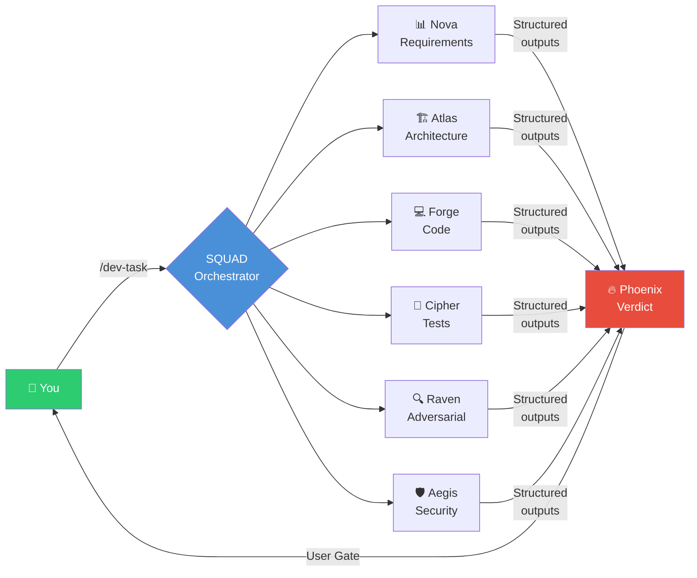

### What makes SQUAD different

| Feature | Other AI Tools | SQUAD |
|---|---|---|
| **Architecture awareness** | Grep the codebase | Pre-built Knowledge Graph — 2-hop blast radius in milliseconds |
| **Code review** | One model says "looks good" | 5 parallel agents: adversarial + security + architecture + QA + code quality |
| **Model selection** | Whatever the IDE uses | Auto-routes each agent to the right model (Opus for reasoning, Flash for docs) |
| **Execution** | Sequential chat | True parallel agent dispatch (up to 5 concurrent on Claude Code) |
| **Safety** | Trust the output | Phase gates — you approve before each phase advances |
| **Learning** | None | `/evolve` — analyzes execution history, proposes evidence-backed skill improvements |
| **Financial analysis** | N/A | 7 quant-grade agents: Beneish M-Score, Kelly criterion, EVT tail risk |
| **IDE lock-in** | One IDE | Same 56 agents across 8 IDEs — Claude Code, Codex, Cursor, Windsurf, Kiro, Gemini, Devin, Antigravity |

---

## See It In Action

### Software Development — `/dev-task`

```
You:    "/dev-task — implement JWT authentication"

Phase 1  → Nova finds 2 missing acceptance criteria in the story
         → Atlas flags rate-limiting gap, shows KG blast radius (8 files)
    ⏸ USER GATE — you review analysis, approve or correct

Phase 2  → Forge writes code matching YOUR patterns (not boilerplate)
         → Phase 1.5: characterization tests on current behavior BEFORE any changes
    ⏸ USER GATE

Phase 3  → Cipher generates tests following your test framework (Jest/pytest/etc)
    ⏸ USER GATE

Phase 4  → 5 reviewers run in parallel:
           Raven (adversarial) + Atlas (architecture) + Sentinel (QA) + Forge (code) + Cipher (tests)
         → Phoenix synthesizes: 0 critical, 1 major (null check missing on line 47)
    ⏸ USER GATE

Phase 5  → PR created, tracking logged
```

### Financial Analysis — `/financial-analysis`

```
You:    "/financial-analysis RELIANCE.NS"

Phase 0  → Asks what data you have (yfinance/Bloomberg/none)
         → Provides Python snippet if needed, waits for you to paste output

Phase 1  → Charts: RSI 61, above 200 SMA, bullish engulfing on daily
           Options P/C ratio 0.72, IV squeeze building

Phase 2  → Ledger: PE 24x vs sector 28x, FCF +18% YoY
           Beneish M-Score -2.4 (safe), 3/25 forensic screens triggered

Phase 3  → Quant: Sharpe 0.84, Kelly 11%, P(ruin|1yr) 2.3%
           EVT tail risk: normal understates by 3.1x

Phase 4  → Sage: Reinvestment runway ~7 years at current ROIC

Phase 5  → Prism: Devil's advocate — regulatory risk is unpriced [VERIFIED-3]

Phase 6  → 3 options: Buy / Wait / Avoid — each with Kelly fraction + CVaR
```

**Works offline. Zero npm dependencies. Same agents, config, and skills across 8 IDEs.**

---

## Table of Contents

### Part I — Getting Started
1. [Installation](#installation)
2. [Setup](#setup)
3. [Quick Start](#quick-start)

### Part II — Understanding SQUAD
4. [Core Concepts](#core-concepts)
5. [The Grounding Waterfall](#the-grounding-waterfall)
6. [How Agents Are Orchestrated](#how-agents-are-orchestrated)
7. [Multi-Model Routing](#multi-model-routing)
8. [Parallel Execution & Dispatch Paths](#parallel-execution--dispatch-paths)

### Part III — All 56 Agents
9. [Agent Packs Overview](#agent-packs-overview)
10. [Core Agents (14)](#core-agents-14)
11. [Extended Core (3)](#extended-core-3)
12. [Math & Theory Pack (6)](#math--theory-pack-6)
13. [AI/ML Pack (5)](#aiml-pack-5)
14. [Systems & Data Pack (5)](#systems--data-pack-5)
15. [Startup Pack (3)](#startup-pack-3)
16. [Financial Pack (7)](#financial-pack-7)
17. [Specialized Agents (13)](#specialized-agents-13)

### Part IV — All 34 Skills
18. [Skills (Slash Commands)](#skills-slash-commands)

### Part V — Deep Dives
19. [Supported IDEs](#supported-ides)
20. [Supported Model Providers](#supported-model-providers)
21. [Knowledge Graph](#knowledge-graph)
22. [Financial & Consulting Analysis Suite](#financial--consulting-analysis-suite)
23. [Skill Self-Evolution — /evolve](#skill-self-evolution--evolve)
24. [Token Compression Engine](#token-compression-engine)

### Part VI — Reference
25. [Configuration Reference](#configuration-reference)
26. [Project Structure](#project-structure)
27. [Adding a New IDE](#adding-support-for-a-new-ide)
28. [Adding a New Model Provider](#adding-support-for-a-new-language-model)
29. [Security & Privacy](#security--privacy)
30. [Testing](#testing)
31. [FAQ](#faq)
32. [Contributing](#contributing)
33. [Credits & Acknowledgments](#credits--acknowledgments)

---

## Installation

```bash
npx sqad-public init
```

That's it. One command. ~10 seconds.

With specific IDEs: `npx sqad-public init --ide claude,cursor,windsurf`

Without npm: `curl -fsSL https://raw.githubusercontent.com/adityashubham1997/sqad-public/main/install.sh | bash`

**Requirements:** Node.js >= 18.

**What `init` does:**

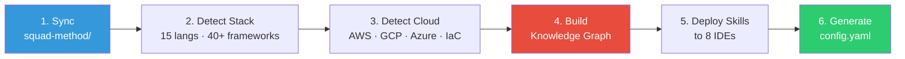

On subsequent runs, `init` **syncs** new agents/skills/tools while preserving your `config.yaml` and `output/`.

---

## Setup

After installation, run `/squad-setup` inside your IDE:

| # | Question | Required | Example |
|---|---|---|---|
| 1 | Your name | ✅ | "Aditya" |
| 2 | Your role | ✅ | "Senior Engineer" |
| 3 | Team name | ✅ | "Platform" |
| 4 | Company name | | "Acme Corp" |
| 5 | Industry / domain | | "fintech" |
| 6 | Project name | | "payments-api" |
| 7 | Project description | | "REST API for payment processing" |
| 8 | Project type | | "api" |
| 9 | Sprint board URL | | Auto-detects Jira/Linear/GitHub/Shortcut/Notion |

Shows a **config completeness score** at the end. Without `/squad-setup`, SQUAD still works — tech detection ran at install. But agents won't know your name, team, or project context.

---

## Quick Start

| Command | What it does |
|---|---|
| `/dev-task` | Full 6-phase implementation: analyse → spec → code → test → review → PR |
| `/review-code` | Pre-commit review by Forge + Raven + Sentinel |
| `/brainstorm` | Multi-agent ideation with all 56 agents |
| `/financial-analysis` | Quant-grade forensic financial analysis by ticker |
| `/refresh` | Scan workspace, rebuild knowledge graphs and context |
| `/health` | Agent effectiveness report with skill utility scores |

Every skill pauses at **user gates** — you approve before each phase advances.

---

# Part II — Understanding SQUAD

## Core Concepts

Before diving into architecture, here's how SQUAD's pieces fit together:

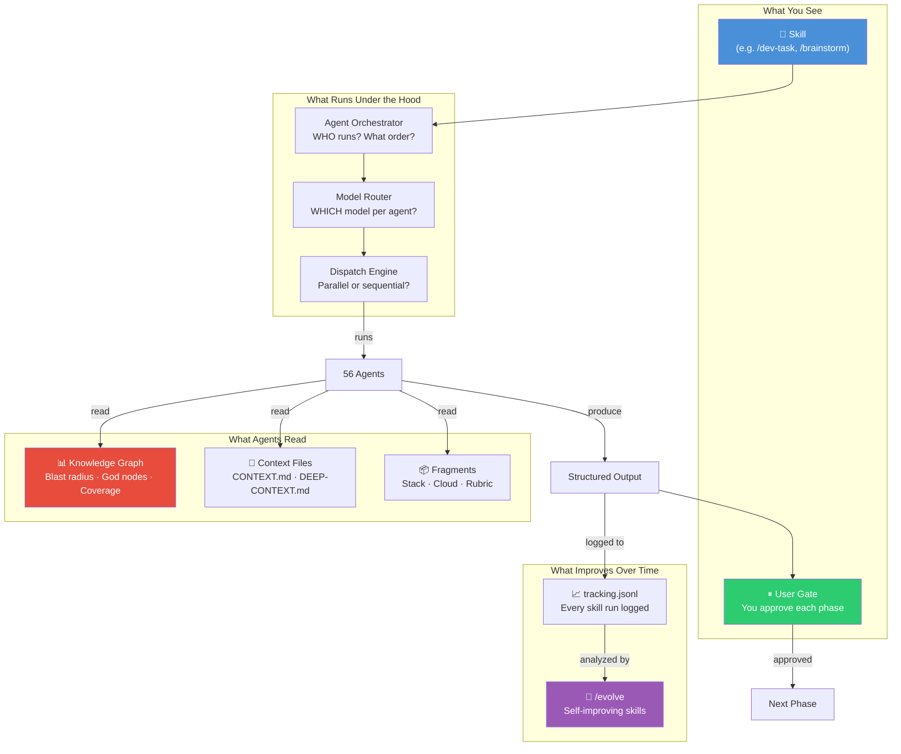

**Key principles:**
- **Agents are lazy-loaded** — only agents needed for the current skill enter context
- **Fragments are conditional** — Python projects load Python rubric; AWS projects load AWS fragments
- **Everything is deterministic** — same inputs → same agent dispatch → same outputs (content-hashed)
- **Nothing phones home** — zero network calls, zero telemetry, zero dependencies

---

## The Grounding Waterfall

Before any agent does work, SQUAD follows an **evidence-first protocol** — a strict hierarchy of what to read, in what order.

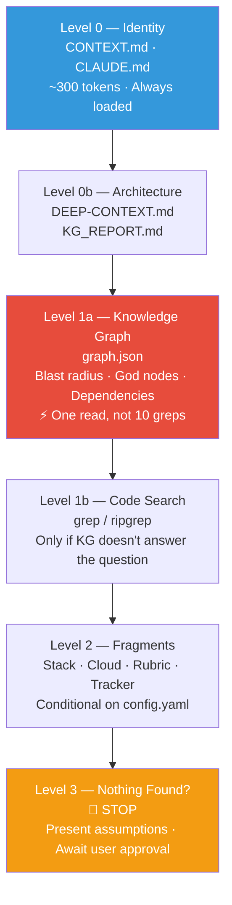

**Why this matters:** The KG answers "what depends on this file?" in one JSON read — what would otherwise take 3–10 grep commands. Pre-computing blast radius, test coverage, and god-node status saves **~80% of exploration tokens** per workflow.

### Context Digest (mandatory Phase 1 output)

Every `/dev-task` starts with a Context Digest — agents can't proceed until this is populated:

```
━━━ CONTEXT DIGEST ━━━

Files Read:
  ✅ CONTEXT.md (repo) — 200 lines
  ✅ DEEP-CONTEXT.md — 180 lines
  ✅ KG_REPORT.md — 45 nodes, 38 edges
  ❌ complete-flow.md — not found

Scope Analysis (from KG):
  Files in change path: 4
  God nodes in scope: none
  Untested files in scope: lib/generate/ide-skills.js
  Cross-community changes: NO

Blast Radius: LOW — 3 reverse deps, 2 test files covering scope

Assumptions:
  [ASSUMPTION-1]: ... — CONFIDENCE: HIGH
```

---

## How Agents Are Orchestrated

The Agent Orchestrator builds a **dependency DAG**, identifies parallel layers, and enforces completion.

### Phase 1 — Analysis (DAG with fan-out)

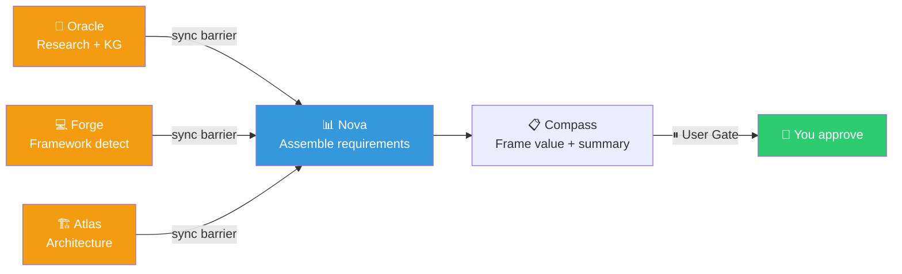

**Layer 1 (parallel):** Oracle + Forge + Atlas — no dependencies, fan out simultaneously.
**Sync barrier:** Wait for all 3 to complete + validate their outputs.
**Layer 2 (sequential):** Nova (consumes Layer 1 outputs) → Compass (consumes Nova's output).

### Phase 5 — Multi-Agent Review (5 parallel reviewers)

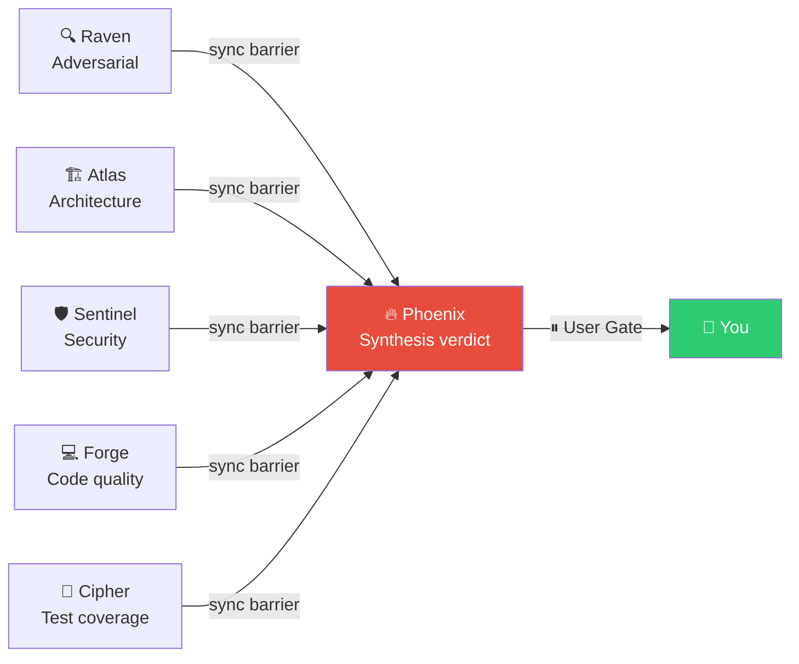

### Guarantees (enforced by 30 hard rules)

| Rule | What It Guarantees |
|---|---|
| **R3 — Output Contracts** | Every agent declares inputs/outputs in YAML. Schema-validated. |
| **R4 — Determinism** | Inputs content-hashed (SHA-256). Same hash → same dispatch. Run manifest logged. |
| **R6 — Completion Verification** | Expected agents vs. actual agents compared after every phase. Missing → re-dispatch. |
| **R8 — Anti-Skip** | NEVER skip an agent to save time. Every declared agent MUST run. |
| **R9 — Gate Ledger** | Phases don't advance without user approval. Gate status persisted to disk. |

---

## Multi-Model Routing

SQUAD doesn't use one model for everything. Each agent is routed to the **right model for its task**.

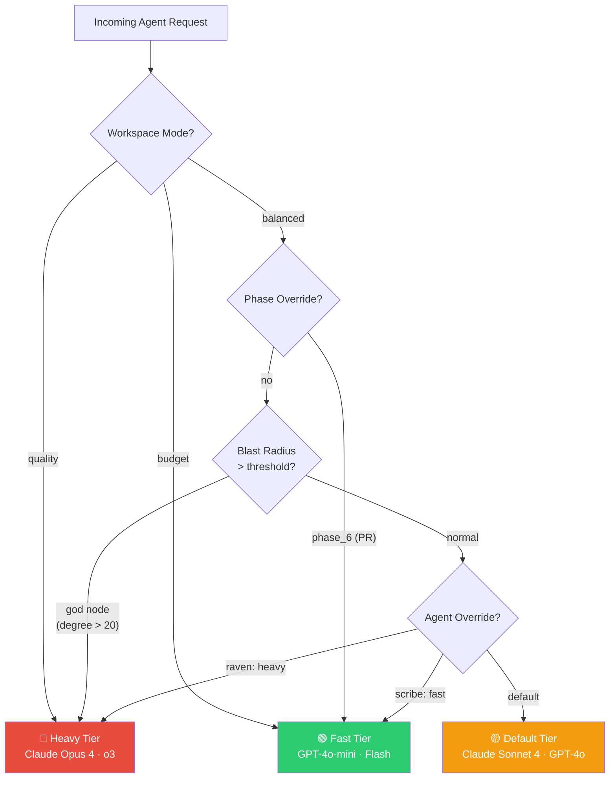

### Priority chain (highest wins)

```
workspace_mode → phase_override → blast_radius → budget_cap → agent_override → default
```

### Default agent assignments

| Agent | Model Tier | Reason |
|---|---|---|
| **Raven** | 🔴 Heavy | Adversarial second-order reasoning |
| **Atlas** | 🔴 Heavy | Architecture blast radius + threat modeling |
| **Phoenix** | 🔴 Heavy | Complex multi-agent verdict merging |
| **Forge** | 🟡 Default | Good balance of speed and quality |
| **Scribe** | 🟢 Fast | Structural pattern matching, no deep reasoning |
| All others | 🟡 Default | Unless overridden in config.yaml |

**Auto-upgrade:** When an agent is about to modify a **god node** (KG degree > 20), the router automatically upgrades to the heavy tier — no configuration needed.

---

## Parallel Execution & Dispatch Paths

Not all IDEs can run agents in parallel. SQUAD auto-detects what's available and picks the optimal path:

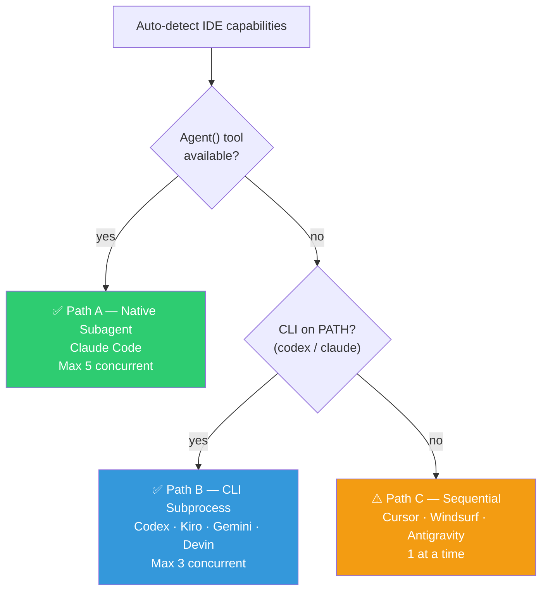

| Path | True Parallelism | What's preserved | What differs |
|---|---|---|---|
| **A** (Native) | ✅ Max 5 concurrent | All correctness guarantees | Best wall-clock |
| **B** (CLI) | ✅ Max 3 concurrent | All correctness guarantees | Good wall-clock |
| **C** (Sequential) | ❌ One at a time | All correctness guarantees | Slowest wall-clock |

**Path C preserves:** dependency ordering, output contracts, run manifest, determinism hashing, anti-skip rules, gate ledger, completion verification. Only wall-clock time and per-agent model isolation differ.

---

# Part III — All 56 Agents

## Agent Packs Overview

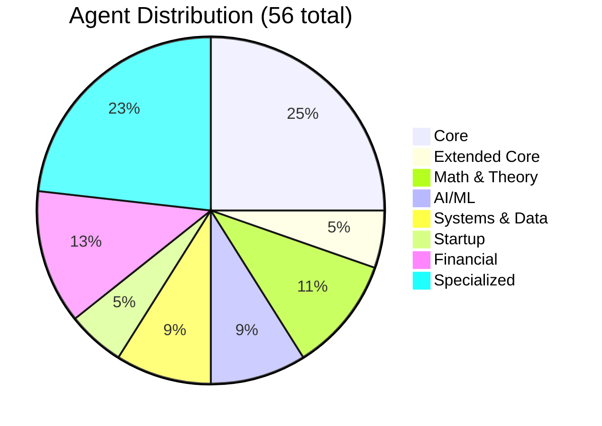

| Pack | Count | Primary Use Case |
|---|---|---|
| **Core** | 14 | Software development lifecycle |
| **Extended Core** | 3 | Security architecture, platform ops, cross-agent oversight |
| **Math & Theory** | 6 | Algorithm correctness, complexity, proofs |
| **AI/ML** | 5 | Neural networks, model evaluation, edge AI |
| **Systems & Data** | 5 | Distributed systems, databases, data pipelines |
| **Startup** | 3 | Founding strategy, GTM, financial modeling |
| **Financial** | 7 | Market analysis, trading, investment |
| **Specialized** | 13 | Games, security, performance, DevOps, data |

All agents install together. Packs are logical groupings — agents are **lazy-loaded** per skill (only the agents a skill needs enter context).

---

## Core Agents (14)

The foundation. These agents cover the entire software development lifecycle.

| Agent | Icon | Role | What They Actually Do |
|---|---|---|---|
| **Nova** | 📊 | Requirements Analyst | Finds missing acceptance criteria, validates stories, identifies gaps BEFORE work begins |
| **Atlas** | 🏗️ | Solution Architect | Architecture blast radius (from KG), threat modeling, technology trade-offs |
| **Forge** | 💻 | Implementation Lead | Writes code matching YOUR patterns. Self-reviews before handing off. |
| **Cipher** | 🧪 | QA Engineer | Test generation following your test framework. Coverage analysis. TDD enforcement. |
| **Sentinel** | 🧪 | QA Architect | Test strategy, risk-based planning, test pyramid balance |
| **Raven** | 🔍 | Adversarial Reviewer | Actively tries to break your code. Logic bugs, edge cases, second-order effects. |
| **Catalyst** | 🚀 | Release Engineer | Release readiness, quality gate validation, compliance (L10N, security, a11y) |
| **Oracle** | 🔬 | Technical Researcher | Domain research, precedent analysis, codebase investigation |
| **Scribe** | 📚 | Technical Writer | Documentation, changelogs, API docs |
| **Compass** | 📋 | Product Manager | Value framing, story validation, scope control |
| **Tempo** | 🎯 | Scrum Master | Sprint status, velocity tracking, retrospectives |
| **Aegis** | 🛡️ | Security Engineer | OWASP Top 10, auth/authz audit, secrets management, CVE scanning |
| **Stratos** | ☁️ | Cloud Architect | Cloud infra design, IaC review, cost optimization |
| **Phoenix** | 🔥 | DevOps / SRE | Synthesizes multi-agent findings into a single actionable verdict |

## Extended Core (3)

Agents that fill unique functional lanes not covered by the 14 core agents.

| Agent | Icon | Role | What They Actually Do |
|---|---|---|---|
| **Trinity** | 🛡️ | Security Architect | Access control design, STRIDE threat modeling, privilege escalation analysis |
| **Otis** | 🔧 | Platform Specialist | Build systems, deploy verification, framework detection |
| **Krishna** | 🌟 | Omniscient Overseer | Cross-agent flaw detection, convergence forcing, identifies 100x solutions |

## Math & Theory Pack (6)

For algorithm correctness, complexity analysis, and mathematical proofs.

| Agent | Icon | Role | Specialty |
|---|---|---|---|
| **Tao** | ∞ | Lead Mathematician | Proof construction, complexity bounds |
| **Knuth** | 📐 | Algorithm Analyst | Exact running time, literate code analysis |
| **Ramanujan** | ✨ | Intuitive Mathematician | Radical shortcuts, pattern recognition |
| **Hardy** | 🔬 | Rigorous Mathematician | Proof validation, counter-example construction |
| **Pearl** | 🔗 | Lead Statistician | Causal inference, Bayesian networks, DAGs |
| **Gelman** | 📊 | Bayesian Statistician | Model critique, posterior predictive checks |

## AI/ML Pack (5)

For neural network architecture, model evaluation, and edge deployment.

| Agent | Icon | Role | Specialty |
|---|---|---|---|
| **Andrej** | 🧠 | AI Supervisor | Neural nets from scratch, training loops |
| **Yann** | 🌊 | Chief AI Scientist | World models, self-supervised learning |
| **Scott** | 📱 | On-Device AI Architect | Quantization, edge deployment, latency budgets |
| **Woz** | 🔓 | Open Source AI Lead | Reproducibility, open-weight models |
| **Percy** | 📏 | AI Eval Lead | HELM benchmarks, bias/fairness, calibration |

## Systems & Data Pack (5)

For distributed systems, database design, and data pipeline engineering.

| Agent | Icon | Role | Specialty |
|---|---|---|---|
| **Jeff** | 🌐 | Distributed Systems Lead | Scale 1000x, partitioning, consensus |
| **Sanjay** | ⚙️ | Systems Pair Programmer | Memory layout, lock contention, cache lines |
| **Stonebraker** | 🗄️ | Database Architect | Workload-specific DB design, OLTP vs OLAP |
| **Reynold** | 🔀 | Data Systems Engineer | Pipelines, query optimization, data flow |
| **Kyle** | 💥 | DB Correctness Lead | Jepsen-style testing, consistency verification |

## Startup Pack (3)

For founding strategy, go-to-market, and unit economics — grounded in your actual codebase.

| Agent | Icon | Role | Focus |
|---|---|---|---|
| **Richard** | 👑 | Startup CEO | Product-market fit, vision, OKRs |
| **Monica** | 📢 | Startup CMO | Growth loops, GTM strategy, personas |
| **Jared** | 💰 | Startup CFO | Unit economics, runway modeling, pricing |

> **`/startup-founding`** scans your actual codebase and project structure to build context-aware startup strategy — not generic advice.

## Financial Pack (7)

Quant-grade agents for market analysis, forensic accounting, and investment research.

| Agent | Icon | Role | Key Methods |
|---|---|---|---|
| **Charts** | 📉 | Technical Analyst | RSI/MACD, options flow, volume profile, multi-timeframe confluence |
| **Ledger** | 📊 | Forensic Analyst | Beneish M-Score, Benford's Law, accrual anomaly, footnote forensics |
| **Herald** | 📡 | Signal Analyst | Earnings NLP, insider activity, credit market divergence, alt data |
| **Sage** | 🔬 | Structural Researcher | Industry S-curves, moat velocity, Bass diffusion, causal inference |
| **Maven** | 📐 | Strategic Architect | Decision theory, EVPI, Kelly criterion, pre-mortem (7+ failure paths) |
| **Quant** | 📈 | Chief Risk Analyst | EVT tail risk, copulas, ruin probability, Monte Carlo, factor decomposition |
| **Prism-Adversarial** | ⚡ | Adversarial Epistemics | 12-lens challenge, superforecasting, Dutch Book audit, falsifiability cert |

## Specialized Agents (13)

Domain experts for games, performance, DevOps, data, and creative problem-solving.

| Agent | Icon | Role | Domain |
|---|---|---|---|
| **Shadow** | 🕵️ | Security Engineer | Pen-test mindset, cloud/code/infra security |
| **Pixel** | 🎮 | Game Developer | Game engine code, render pipelines, physics |
| **Quest** | 🗺️ | Product Discovery | Game mechanics, balance, progression |
| **Lore** | 📜 | Knowledge Engineer | Narrative design, world-building, dialogue |
| **Spark** | ⚡ | AI Developer | AI/ML framework integration in production |
| **Muse** | 🎨 | AI Researcher | Research synthesis, paper analysis |
| **Dynamo** | 🔋 | Performance Engineer | N+1 detection, query optimization, profiling |
| **Flux** | 🔄 | DevOps Automation | CI/CD pipelines, deployment automation |
| **Index** | ⚡ | Query Optimizer | SQL tuning, index strategy, execution plans |
| **Kernel** | ⚙️ | Systems Programmer | OS-level code, memory management, concurrency |
| **Neuron** | 🧬 | ML Engineer | ML pipelines, model evaluation, data quality |
| **Prism** | 🔺 | Data Analyst | SQL analytics, data models, dashboard quality |
| **Titan** | 🏔️ | Infrastructure | Standards enforcement, quality gates |

---

# Part IV — All 34 Skills

## Skills (Slash Commands)

### Development & Code Quality

| Skill | Agents | What It Does |
|---|---|---|
| `/dev-task` | Nova, Atlas, Forge, Cipher, Raven, Sentinel | Full 6-phase implementation: analyse → spec → code → test → review → PR |
| `/review-code` | Forge, Raven, Sentinel | Quick pre-commit review of uncommitted changes |
| `/review-pr` | Raven, Atlas, Sentinel, Forge, Cipher, Catalyst | Full pull request code review |
| `/review-story` | Raven, Atlas, Sentinel, Forge, Cipher | Validate implementation against acceptance criteria |
| `/dev-analyst` | Nova, Atlas, Oracle, Forge | Deep story analysis: feasibility, architecture, effort |

### Testing & QA

| Skill | Agents | What It Does |
|---|---|---|
| `/qa-task` | Cipher, Sentinel, Raven | End-to-end QA: dependency analysis → test plan → tests |
| `/test-story` | Cipher, Sentinel | Story-aware test generation following existing patterns |
| `/test-repo` | Cipher | Run test suite, analyze results, report coverage |
| `/test-project` | Cipher | Cross-repo test health report |

### Product & Planning

| Skill | Agents | What It Does |
|---|---|---|
| `/create-prd` | Compass, Nova, Atlas, Oracle | Multi-agent product requirements document |
| `/create-story` | Compass, Nova | Story with GIVEN/WHEN/THEN acceptance criteria |
| `/product-researcher` | Oracle, Compass | Deep product research across tracker, web, codebase |

### Multi-Agent Sessions

| Skill | Agents | What It Does |
|---|---|---|
| `/brainstorm` | All agents | Multi-perspective brainstorming — all 56 agents available |
| `/assemble` | All agents | Full group discussion — architecture debates, post-mortems |

### Financial & Strategy

| Skill | Agents | What It Does |
|---|---|---|
| `/financial-analysis` | Charts, Ledger, Herald, Sage, Maven, Quant, Prism-Adversarial | 7-phase forensic analysis by ticker. Adapts to data subscriptions. |
| `/market-research` | Oracle, Sage, Herald, Prism-Adversarial | Structural market & industry deep-dive |
| `/consulting-brief` | Maven, Sage, Prism-Adversarial, Quant | Strategic brief: pre-mortem + EVPI + Kelly + 3 options |
| `/startup-founding` | Richard, Monica, Jared, Oracle, Compass, Atlas, Nova | Codebase-aware startup strategy |

### Sprint & Delivery

| Skill | Agents | What It Does |
|---|---|---|
| `/setup` | Tempo | Configure user, team, company, project, tracker |
| `/standup` | Tempo | Auto-generate daily standup from git + tracker |
| `/retro` | Tempo, Compass, Scribe | Sprint retrospective with live tracker data |
| `/current-sprint` | Tempo | Sprint status at a glance |

### Domain Audits

| Skill | Agents | What It Does |
|---|---|---|
| `/data-audit` | Neuron, Prism | ML pipeline and data quality audit |
| `/db-audit` | Dynamo | Database schema, query performance, migration safety |
| `/infra-audit` | Stratos, Aegis | Infrastructure observability and monitoring |
| `/os-audit` | Kernel | OS-level code, process management, systems patterns |
| `/game-review` | Pixel, Quest | Game engine: performance, networking, design |
| `/ai-ideate` | — | Design agentic workflow and AI automation ideas |
| `/ai-workflow-audit` | — | Audit existing AI/LLM integrations in the codebase |

### Meta & Learning

| Skill | Agents | What It Does |
|---|---|---|
| `/evolve` | — | Skill self-evolution: analyze tracking → propose edits → branch |
| `/health` | — | Agent effectiveness, skill utility grades (A–D), evolution candidates |
| `/refresh` | — | Scan workspace, rebuild KG, regenerate context files |
| `/refresh-git` | — | Enrich context from PR review history and git patterns |
| `/git-learn` | Scribe | Extract learnings from PR history, enrich CONTEXT.md |

---

# Part V — Deep Dives

## Supported IDEs

| IDE | Parallel | Multi-Model | Hook Enforcement | Skill Format |
|---|---|---|---|---|
| **Claude Code** | ✅ Max 5 | ✅ Anthropic + OpenAI + Google | Automatic (settings.json) | `.claude/skills/` |
| **Codex** (OpenAI) | ✅ Max 3 | ✅ OpenAI + Anthropic | Script (hooks.sh) | `.codex/skills/` |
| **Kiro** (AWS) | ✅ Max 3 | ✅ Bedrock + Q + OpenAI + Google + Anthropic | Script (hooks.sh) | `.kiro/skills/` |
| **Gemini** (Google) | ✅ Max 3 | ✅ Google + Anthropic + OpenAI | Script (hooks.sh) | `.gemini/skills/` |
| **Devin** (Cognition) | ✅ Max 3 | ✅ Anthropic + OpenAI + Google | Script (hooks.sh) | `.devin/skills/` |
| **Cursor** | ❌ Sequential | ✅ Anthropic + OpenAI + Google | Script (hooks.sh) | `.cursor/rules/*.mdc` |
| **Windsurf** | ❌ Sequential | ❌ Single model | Script (hooks.sh) | `.windsurf/skills/` |
| **Antigravity** | ❌ Sequential | ✅ Anthropic + OpenAI | Script (hooks.sh) | `.agent/skills/` |

---

## Supported Model Providers

| Provider | Models | Best For |
|---|---|---|
| **Anthropic** | Claude Opus 4, Claude Sonnet 4 | Reasoning, code generation, implementation |
| **OpenAI** | o3, GPT-4o, GPT-4o-mini | Security reasoning, fast structured output |
| **Google** | Gemini 2.5 Pro, Gemini 2.0 Flash | Long-context research (1M tokens) |
| **Amazon Bedrock** | Claude via Bedrock, Titan, Llama 3 | AWS-native multi-model gateway |
| **Amazon Q** | Q Developer | AWS-specific codebase knowledge |

---

## Knowledge Graph

SQUAD includes a built-in, zero-dependency knowledge graph that pre-computes what agents need to know about your codebase.

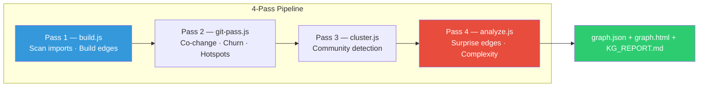

```bash
node squad-method/tools/knowledge-graph/build.js <repo-path>
# Optional: function-level AST analysis
node squad-method/tools/knowledge-graph/build.js <repo-path> --ast
```

### 4-Pass Analysis Pipeline

| Pass | Module | What It Does |
|---|---|---|
| 1 | `build.js` | Scan source files, extract imports, build dependency edges |
| 2 | `git-pass.js` | Git history: co-change patterns, churn hotspots, author count |
| 3 | `cluster.js` | Label propagation community detection (graph-aware, not directory-based) |
| 4 | `analyze.js` | Surprise edges, hotspot scoring, complexity grading (A–F) |

Optional Pass 5 (`--ast`): function-level nodes and call-graph edges via regex or tree-sitter.

### Supported Languages (15)

JavaScript, TypeScript, Python, Go, Rust, Java, Ruby, C, C++, C#, Swift, Kotlin, Scala, PHP, Protocol Buffers, GraphQL

### Output

```
<repo>/knowledge-graph-out/
├── graph.json      ← Full graph: nodes, edges, communities, hotspots, complexity
├── graph.html      ← Interactive D3-powered force-directed visualization
└── KG_REPORT.md    ← Human-readable analysis for agents
```

### Query API

Agents can query the graph programmatically via `squad-method/tools/knowledge-graph/query.js`:

```javascript
import { loadGraph, reverseDeps, godNodes, untestedFiles, ripple, shortestPath } from './query.js';

const graph = loadGraph('/path/to/repo');
reverseDeps(graph, 'lib/auth/login.js');  // what breaks if I change this?
godNodes(graph);                          // files with degree > 30
untestedFiles(graph);                     // source files with no tests
ripple(graph, 'lib/auth/login.js', 2);    // 2-hop blast radius
```

### Context Prioritization

Given a task description, `prioritize.js` ranks which files agents should read first:

```javascript
import { prioritize } from './prioritize.js';
const ranked = prioritize('fix authentication login flow', graph, { topN: 20 });
// Returns files sorted by: keyword match × degree centrality × test coverage gap
```

### Incremental Updates

For large repos, `incremental.js` updates only affected nodes/edges instead of a full rebuild — falls back to full rebuild if > 30% of files changed.

### Why KG before grep?

| Question | Without KG | With KG |
|---|---|---|
| "What depends on this file?" | 3–10 grep commands | One graph edge lookup |
| "Is this file high-risk?" | Manual analysis | God node flag + hotspot score |
| "What tests cover this?" | Grep for imports | Test edge query |
| "What's the blast radius?" | Recursive grep | 2-hop reachability (instant) |

Saves **~80% of exploration tokens** per workflow.

---

## Financial & Consulting Analysis Suite

Seven quant-grade agents across four analysis streams — triggered by ticker symbol, adapts to your data subscriptions.

> **Design principle:** "McKinsey gives you frameworks. Renaissance Technologies gives you edge. Every claim is falsifiable. Every conclusion has a confidence interval."

### How `/financial-analysis` works

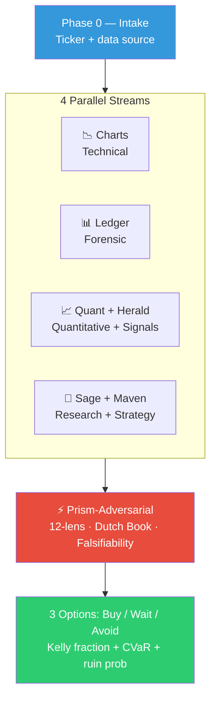

### Data source adaptation

| What You Have | What Gets Unlocked |
|---|---|
| **Nothing** | LLM training data only — tagged [LLM-TRAINING], lower confidence |
| **yfinance (free)** | Provides Python snippet → you run + paste → full OHLCV + options |
| **Screener.in / Tickertape** | Indian fundamentals + sector context |
| **TradingView** | Paste chart key levels + indicators |
| **Bloomberg / Reuters** | Full data: real-time, options chain, insider flow, transcripts |
| **Earnings call transcript** | Herald runs Shannon entropy + tone shift analysis |

### 4-Gate Verification Protocol

Every major claim goes through four gates:

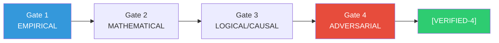

Claims classified: `[VERIFIED-4]` (all gates) → `[VERIFIED-3]` → `[VERIFIED-2]` → `[UNVERIFIED]` (never in recommendations).

### Agent specializations

- **Ledger**: Beneish M-Score, Benford's Law, Lev-Thiagarajan 12 signals, accrual anomaly (Jones Model), footnote forensics, DuPont 5-factor
- **Herald**: Granger causality validation, Shannon entropy of earnings calls, Breeden-Litzenberger options-implied distributions, Bayesian composite scoring
- **Sage**: Bass diffusion model, power law analysis (Clauset-Shalizi-Newman), formal causal inference (DiD, IV, DAGs), ergodicity economics
- **Maven**: Bayesian decision theory + EVPI, mechanism design, mandatory pre-mortem (7+ failure paths), Kelly criterion, DMDU
- **Quant**: Extreme Value Theory for tails, copula tail dependence, ruin probability, bootstrap CI, AIC/BIC model selection
- **Prism-Adversarial**: 12-lens analysis, superforecasting (Tetlock), Dutch Book coherence audit, reference class forecasting, Fermi cross-checks

---

## Skill Self-Evolution — /evolve

SQUAD learns from its own execution history and proposes evidence-backed skill improvements.

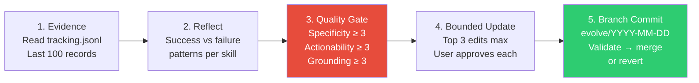

**Safety constraints:**
- **Max 3 edits per cycle** (gradient clipping)
- Edits land on a **branch**, never main
- **User gate at every edit** — never auto-applied
- Both success AND failure records analyzed
- `/health` shows skill utility grades (A–D) and flags evolution candidates

---

## Token Compression Engine

Native JS compression pipeline — no external dependencies.

```
Input → Detect content type → Mask (protect errors/KG data) → Handler → Unmask → Output
```

| Content Type | Handler | Typical Ratio |
|---|---|---|
| Code | Strip comments, collapse imports | 40–60% |
| Grep output | Group by file, deduplicate | 50–70% |
| JSON | Minify, truncate arrays > 10 items | 60–80% |
| Logs / errors | Collapse repeated lines, summarize stacks | 50–70% |
| File listings | Summarize by extension, collapse deep paths | 60–80% |

**Protected (never compressed):** error messages, test assertions, KG graph data, user input.

---

# Part VI — Reference

## Configuration Reference

`squad-method/config.yaml` — auto-generated at install, filled by `/setup`:

```yaml
company:
  name: ""
  domain: ""                   # fintech | healthcare | saas | gaming | ...
  compliance: []               # soc2 | hipaa | pci-dss | gdpr

project:
  name: ""
  type: ""                     # web-app | api | library | cli | mobile | infra | monorepo | game | ai-ml
  maturity: ""                 # greenfield | brownfield | migration

stack:
  languages: []                # auto-detected
  frameworks: []               # auto-detected
  test_command: "npm test"

model_routing:
  default: "default"           # fast | default | heavy
  mode: "balanced"             # balanced | quality | budget
  agent_overrides: {}          # e.g. { raven: heavy, scribe: fast }
  complexity_upgrade:
    enabled: true
    blast_radius_threshold: 20

token_budget:
  max_context_tokens: 50000
  compression: none            # none | native

knowledge_graph:
  enabled: true
  auto_rebuild: true
  ast_enabled: false           # function-level analysis (opt-in)

agents:
  built_in: 56
  custom: []
  packs:
    extended_core: [krishna, otis, trinity]
    math_theory: [tao, knuth, ramanujan, hardy, pearl, gelman]
    ai_ml: [andrej, yann, scott, woz, percy]
    systems_data: [jeff, sanjay, stonebraker, reynold, kyle]
    startup: [richard, monica, jared]
    financial: [charts, ledger, herald, sage, maven, quant, prism-adversarial]

ides:
  installed: []                # auto-detected: claude, devin, windsurf, cursor, codex, kiro, gemini, antigravity
```

---

## Project Structure

```
workspace/
├── CONTEXT.md                 ← Root context (always loaded, ~300 tokens)
├── CLAUDE.md / AGENTS.md      ← IDE-specific copies
├── DEEP-CONTEXT.md            ← Architecture from KG analysis
│
├── squad-method/
│   ├── config.yaml            ← Single source of truth
│   ├── agents/                ← 56 agent personas (lazy-loaded per skill)
│   │   ├── _base-agent.md     ← Base protocols
│   │   ├── nova.md … phoenix.md    ← 14 core
│   │   ├── trinity.md … krishna.md ← 3 extended core
│   │   ├── tao.md … gelman.md     ← 6 math/theory
│   │   ├── andrej.md … percy.md    ← 5 AI/ML
│   │   ├── jeff.md … kyle.md      ← 5 systems/data
│   │   ├── richard.md … jared.md   ← 3 startup
│   │   ├── charts.md … prism-adversarial.md ← 7 financial
│   │   └── shadow.md … titan.md    ← 13 specialized
│   ├── skills/                ← 34 skill definitions
│   ├── fragments/             ← Conditional knowledge modules
│   │   ├── rubric/            ← Language-specific review rubrics
│   │   ├── stack/             ← Framework knowledge
│   │   ├── cloud/             ← Cloud provider guidance
│   │   ├── tracker/           ← Sprint tracker integration
│   │   └── agent-orchestrator.md ← 30 hard orchestration rules
│   ├── tools/
│   │   ├── knowledge-graph/   ← KG builder, query API, prioritize, AST pass
│   │   ├── compress/          ← Token compression pipeline
│   │   ├── router/            ← Multi-model routing engine
│   │   └── dispatch/          ← Parallel execution adapters per IDE
│   └── output/
│       ├── tracking.jsonl     ← Operation log (feeds /health, /evolve)
│       └── meta-skill.md      ← Optimizer memory across /evolve cycles
│
└── <repo>/knowledge-graph-out/
    ├── graph.json             ← Full dependency graph
    ├── graph.html             ← Interactive D3 visualization
    └── KG_REPORT.md           ← Human-readable analysis
```

### Fragment Conditional Loading

A Python/AWS/Jira project loads Python rubric + AWS fragments + Jira tracker. A JavaScript/no-cloud project loads a completely different set. Agents never see irrelevant knowledge.

### MCP Tracker Integration

| Tracker | MCP Server | Config |
|---|---|---|
| Jira | `@anthropic/mcp-jira` | `.{ide}/mcp.json` |
| Linear | `@anthropic/mcp-linear` | `.{ide}/mcp.json` |
| GitHub Issues | Built-in (Claude Code) | `.{ide}/mcp.json` |
| Shortcut | `shortcut-mcp-server` | `.{ide}/mcp.json` |
| Notion | `@modelcontextprotocol/server-notion` | `.{ide}/mcp.json` |

---

## Adding Support for a New Language Model

### Step 1 — Add provider to registry

Edit `squad-method/tools/router/providers.cjs`:

```javascript
var MISTRAL = {
  id: 'mistral',
  models: { fast: 'mistral-small-latest', default: 'mistral-large-latest', heavy: 'mistral-large-latest' },
  supports_effort: false,
  max_context: 128000,
};
```

### Step 2 — Add to IDE provider mapping

```javascript
cursor: {
  primary: ANTHROPIC,
  secondary: [OPENAI, GOOGLE, MISTRAL],  // ← add here
}
```

### Step 3 — (Optional) Agent affinity rules

```javascript
var AGENT_PROVIDER_AFFINITY = {
  scribe: { prefer: 'mistral', tier: 'fast', reason: 'structured_output' },
};
```

### Step 4 — Run tests

```bash
cd sqad-public && node --test test/providers.test.js
```

---

## Adding Support for a New IDE

### Step 1 — Create a transformer

`lib/transform/volta.js`:

```javascript
import { deploySkillDir } from './base.js';

export function deploy(workspacePath, skill, options = {}) {
  return deploySkillDir(workspacePath, skill, '.volta', options);
}
export const IDE_ID = 'volta';
export const SKILLS_PATH = '.volta/skills';
```

### Step 2 — Register in the IDE skills generator

`lib/generate/ide-skills.js`:

```javascript
const TRANSFORMER_MAP = {
  // ...existing...
  volta: '../transform/volta.js',
};
```

### Step 3 — Add IDE detection

`lib/detect/ide.js`:

```javascript
IDE_CHECKS.push({ id: 'volta', name: 'Volta', configDir: '.volta', binary: 'volta' });
```

### Step 4 — Create a dispatch adapter

`squad-method/tools/dispatch/adapter-volta.cjs`:

```javascript
var BaseAdapter = require('./adapter-base.cjs');
function VoltaAdapter(config) { BaseAdapter.call(this, 'volta', config); }
VoltaAdapter.prototype = Object.create(BaseAdapter.prototype);
// Implement: dispatchAgent, dispatchParallel, buildMultiModelPlan
```

### Step 5 — Add to provider mapping

`providers.cjs`:

```javascript
volta: {
  primary: ANTHROPIC,
  secondary: [OPENAI],
  supports_parallel: false,
  parallel_mechanism: 'sequential',
  max_parallel: 1,
}
```

### Step 6 — Update hooks and parity test

```bash
# Add detection in hooks.sh
# Add to ide-parity-test.sh
bash squad-method/tools/ide-parity-test.sh
```

---

## Security & Privacy

### Zero-Footprint Design

- **Zero network calls** — SQUAD never phones home, no telemetry, no analytics
- **Zero dependencies** — `package.json` has 0 runtime dependencies
- **Local-only tracking** — `tracking.jsonl` stays on your machine
- **No API keys stored** — environment variables only, never written to files
- **Git exclude** — SQUAD artifacts use `.git/info/exclude` (never modifies `.gitignore`)

### 5-Layer Safety Hooks

`squad-method/tools/hooks.sh` runs at skill boundaries:

| Layer | Hook | What It Checks |
|---|---|---|
| 1 | Skills Gate | SQUAD installed, config present, base-agent present |
| 2 | Pre-Edit Guard | Blocks edits to auto-generated files (`dist/`, lock files, `*.generated.*`) |
| 3 | Secret Detection | Scans for API keys, AWS keys, private keys before commits |
| 4 | Progress Save | Forces progress doc update when context window fills (~40 messages) |
| 5 | Gate Ledger | Verifies all phase gates passed before advancing |

In Claude Code, hooks fire automatically at the harness level (impossible to bypass). In all other IDEs, hooks fire when the skill calls `hooks.sh`.

### Destructive Action Guard

Before any destructive action (delete, drop, force push), agents:
1. State exactly what will be destroyed
2. Ask for explicit confirmation
3. Wait for approval before proceeding
4. Never combine destructive actions

---

## Testing

```bash
# Unit tests
node --test test/*.test.js

# Full suite (unit + e2e)
npm run test:all

# IDE parity check
bash squad-method/tools/ide-parity-test.sh
```

Current: **202 assertions, 0 failures** (unit + e2e + agent contracts).

Test coverage includes:
- Stack / cloud / IDE / tracker detection
- IDE skill deployment (all 8 IDEs)
- Knowledge graph: language patterns (15 languages), community detection, query API
- AST extraction (JS/TS, Python, Go, Java)
- Compression pipeline (all handlers, mask integrity, end-to-end)
- Agent contracts: 56 agents validated (capabilities, determinism, frontmatter)
- Provider routing, dispatch adapters, DAG wiring

---

## FAQ

### How is SQUAD different from just using an AI IDE?

AI IDEs give you one model in a chat. SQUAD adds:
- **56 specialized agents** with distinct review lenses
- **Pre-computed knowledge** via the knowledge graph — agents check dependency data before grepping
- **Conditional fragment loading** — only project-relevant knowledge is loaded
- **Phase-gated workflows** — complex tasks have user approval at each gate
- **Cross-IDE portability** — same agents, skills, and config across 8 IDEs
- **Self-evolution** — `/evolve` improves skills from execution history

### Do I need all 8 IDEs?

No. SQUAD auto-detects installed IDEs and deploys skills only to those. When you run `init` again after updating the package, new skills are synced to all detected IDEs automatically.

### What does "zero dependencies" mean?

`package.json` has literally `"dependencies": {}`. No npm packages. No supply chain risk. Every line of code is in the repo. The tradeoff: regex-based YAML handling instead of a library, and regex-based import parsing in the KG (with AST as an opt-in via `--ast`).

### How do agents find context without loading everything?

1. **Always loaded:** `CONTEXT.md` + `context/index.md` (~500 tokens)
2. **Per skill:** the skill declares which agents and fragments it needs
3. **Per config:** fragments auto-load based on detected stack/cloud/tracker
4. **Queried on demand:** `graph.json` is queried for specific files, never loaded in full

Target: < 8,000 tokens for agent + fragment loading per skill invocation.

### Why check the knowledge graph before grepping?

The KG pre-computes answers to the most common agent questions:
- "What depends on this file?" → graph edges (instant, one read)
- "Is this high-risk?" → god node flag + hotspot score (instant)
- "What tests cover this?" → test edges (instant)
- "What's the blast radius?" → 2-hop reachability query (instant)

Without the KG: 3–10 grep commands across the entire codebase. With the KG: one JSON read. Saves ~80% exploration tokens in typical workflows.

### What are god nodes?

Any file with more than 30 dependency connections (imports + importers). When an agent detects it's modifying a god node:
- Model router **auto-upgrades** to heavy tier
- Review requires **extra approval**
- KG report flags the full blast radius

### What's in `tracking.jsonl`?

Every skill run appends one JSON line with: skill name, agents dispatched, phases completed, review findings (critical/major/minor), outcome, assumptions count. This feeds:
- `/health` — agent effectiveness analysis, skill utility grades (A–D)
- `/evolve` — evidence-backed skill improvement proposals
- Quality gate (V2) — re-dispatches on low-quality output
- Learned classifier (V3 stub) — will predict optimal model tier

### Can I add custom agents?

Yes. Create a `.md` file in `squad-method/agents/` following the frontmatter format of existing agents. Add the agent name to `config.yaml → agents.custom`. The agent is then available to any skill that declares it.

### What are the financial agents useful for?

The seven financial agents (`/financial-analysis`, `/market-research`, `/consulting-brief`) apply quant-fund grade methods — Beneish M-Score, Benford's Law, Granger causality, Kelly criterion, EVT tail risk, Dutch Book coherence — to produce analysis with explicit confidence intervals and falsifiable claims. Every conclusion includes a verification summary (VERIFIED-4 through UNVERIFIED) and a mandatory disclaimer.

### How does `/evolve` work safely?

Edits proposed by `/evolve` always land on a branch (`evolve/YYYY-MM-DD`), never main. The quality rubric requires specificity ≥ 3, actionability ≥ 3, and grounding ≥ 3 — vague rules fail and are rejected. Maximum 3 edits per cycle. User must explicitly accept each edit. After N runs on the branch, if outcomes improve, you merge; if not, you revert.

---

## Contributing

### Quick contributions
- **Bug reports** — open an issue with steps to reproduce
- **Feature suggestions** — open an issue with the use case
- **Typos / docs** — PR directly

### Code contributions

1. Fork and clone the repo
2. Create a branch: `git checkout -b feature/my-feature`
3. Follow existing patterns (look at similar files first)
4. Add tests — every new feature needs tests
5. Run: `npm run test:all`
6. Run parity check: `bash squad-method/tools/ide-parity-test.sh`
7. Submit PR with what and why

### What we're looking for

- New IDE adapters — see [Adding Support for a New IDE](#adding-support-for-a-new-ide)
- New model providers — see [Adding Support for a New Language Model](#adding-support-for-a-new-language-model)
- New language detection for KG (add to `LANGUAGE_PATTERNS` in `build.js`)
- Stack / cloud / tracker detection fragments
- Rubric modules for additional frameworks
- Bug fixes and test improvements

### Code style

- Use existing patterns — look at similar files before writing new ones
- Zero dependencies — don't add npm packages
- Tests required — if it's testable, test it
- ESM for `lib/` — CommonJS (`.cjs`) for `squad-method/tools/`

---

## Credits & Acknowledgments

### Direct Inspirations

| Source | What We Took | How SQUAD Uses It |
|---|---|---|
| **[Graphify (Karpathy)](https://github.com/karpathy)** | Knowledge graph extraction approach | KG builder: AST/import extraction, community detection, god nodes, git co-change coupling |
| **[Headroom (chopratejas)](https://github.com/chopratejas/headroom)** | Tool output compression pipeline | Inspired `squad-method/tools/compress/`: content-type detection → domain handlers → universal compression |
| **[SkillLens (Microsoft)](https://microsoft.github.io/SkillLens/)** | Skill quality rubric + utility scoring | `/evolve` quality gate: specificity × actionability × grounding. `/health` utility grades (A–D) |
| **[SkillOpt (Microsoft)](https://microsoft.github.io/SkillOpt/)** | Rollout → Reflect → Bounded Update | `/evolve` evolution loop: max 3 edits per cycle, slow-update on branch, meta-skill memory |
| **[RouteLLM (2024)](https://arxiv.org/abs/2406.18665)** | Learned model routing | 3-tier routing: rule-based → quality gate → classifier stub trained from `tracking.jsonl` |
| **[HyperAgentMeta (Meta 2026)](https://arxiv.org/abs/2602.00000)** | Self-improving agent loops | `/evolve` structure: tracking data → failure analysis → surgical skill diffs → human approval |

### Core Concepts

- **Multi-Agent Systems** — Multi-agent debate (Du et al., 2023), mixture-of-agents (Wang et al., 2024)
- **Agentic Coding** — Patterns from Claude Code, Devin, SWE-Agent, OpenHands
- **Knowledge Graphs for Code** — Graph-based dependency analysis inspired by Sourcegraph, CodeQL
- **TDD & Agile** — Review rubrics grounded in Martin, Fowler, Beck, Nygard, OWASP

### Financial Analysis Methodology

Academic citations for quantitative methods used by financial agents:

- Beneish (1999) — M-Score for earnings manipulation detection
- Sloan (1996) — Accrual anomaly: earnings persistence vs cash
- Lev & Thiagarajan (1993) — 12 fundamental signals predicting future returns
- Altman (1968, 2020) — Z-Score for bankruptcy prediction
- Benford (1938), Nigrini (2012) — Benford's Law for fraud detection
- Bass (1969) — Diffusion model for technology adoption
- Peters (2019) — Ergodicity economics
- Tetlock (2015) — Superforecasting and calibrated probability
- Pearl (2009) — Causal inference with DAGs
- Embrechts et al. (1997) — Extreme value theory for tail risk
- Kelly (1956) — Capital allocation criterion

### Model Providers

- **[Anthropic](https://anthropic.com)** — Claude Opus 4 & Sonnet 4
- **[OpenAI](https://openai.com)** — GPT-4o and o3
- **[Google DeepMind](https://deepmind.google)** — Gemini 2.5 Pro (1M context)
- **[Amazon AWS](https://aws.amazon.com/bedrock/)** — Bedrock, Titan, Amazon Q
- **[Meta AI](https://ai.meta.com)** — Llama models via Bedrock

### IDE Platforms

- **[Anthropic Claude Code](https://docs.anthropic.com/en/docs/claude-code)** — Native Agent() API for true parallel execution
- **[OpenAI Codex CLI](https://github.com/openai/codex)** — CLI subprocess dispatch
- **[AWS Kiro](https://kiro.dev)** — Bedrock multi-provider gateway
- **[Google Gemini CLI](https://github.com/google-gemini/gemini-cli)** — Vertex AI integration
- **[Cursor](https://cursor.com)** — Multi-model IDE, `.mdc` rule format
- **[Windsurf](https://codeium.com/windsurf)** — Cascade AI with skill/workflow system
- **[Antigravity](https://antigravity.dev)** — AI-native development environment

---

## License

MIT — see [LICENSE](LICENSE) for details.

---

<div align="center">

**Built for developer experience, not vendor lock-in.**

[npm](https://www.npmjs.com/package/sqad-public) · [Issues](https://github.com/adityashubham1997/sqad-public/issues) · [Contribute](#contributing)

</div>
